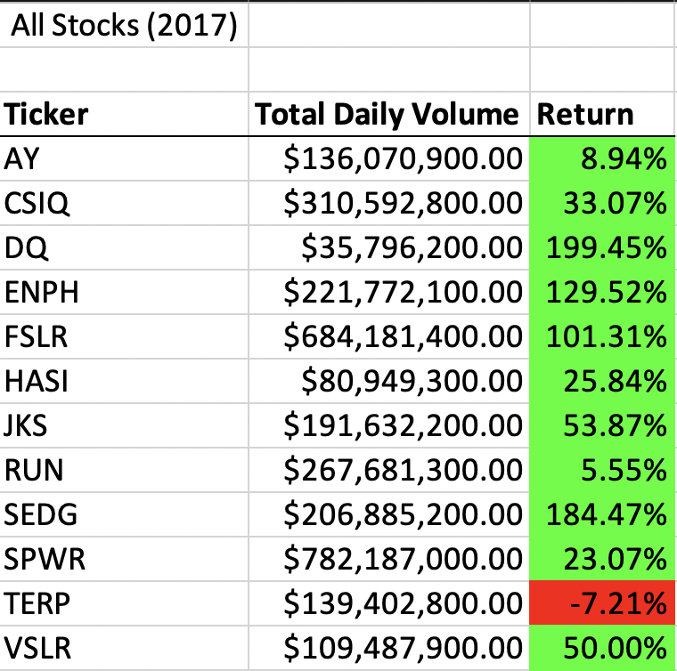
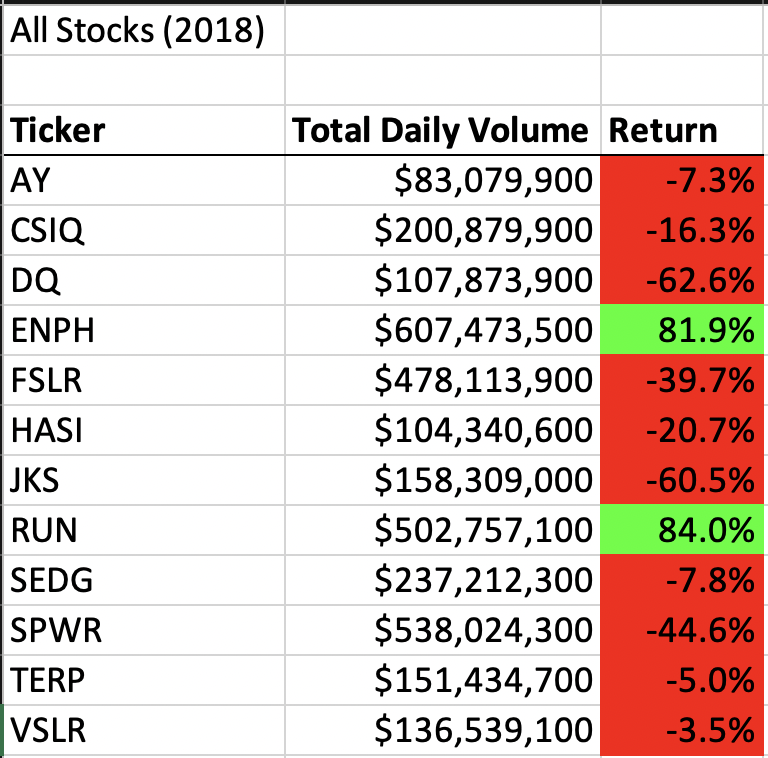
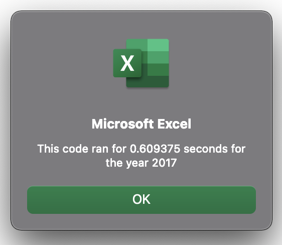
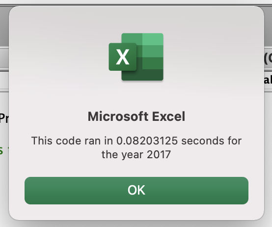
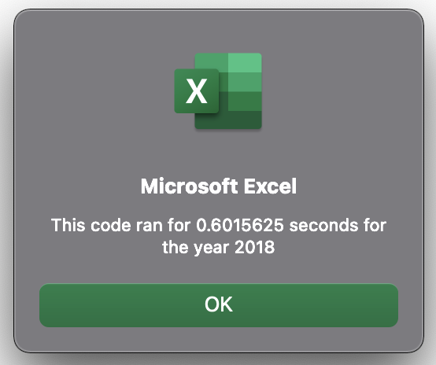
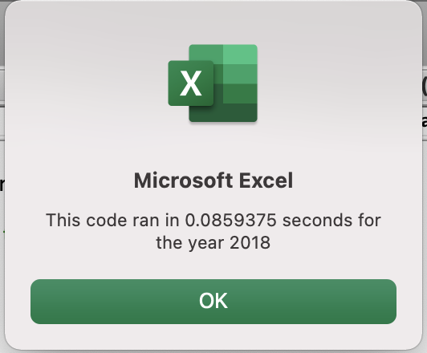
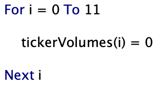
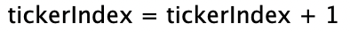
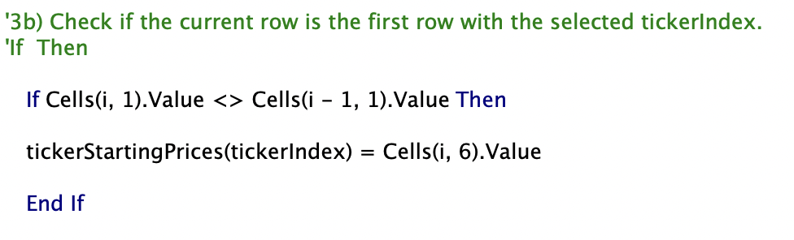
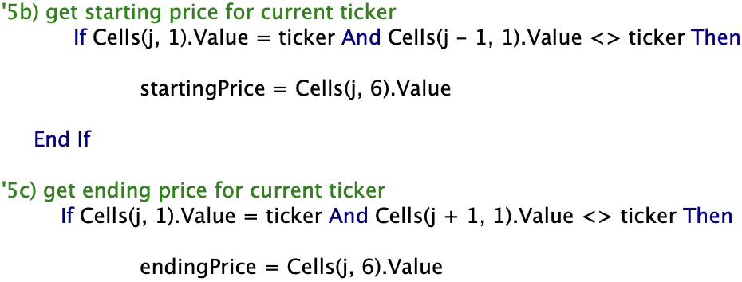

# Stock Analysis with VBA

## Overview of Project

In this project I conduct an investment analysis on the historical data of 12 green stocks for the years 2017 and 2018. I use the built-in developer program in Excel called Visual Basic for Applications (VBA) to conduct this analysis. The code I run is a refactored code that when compared to the original script gives me a faster result. I provide insights by comparing the performance of the green stocks in 2017 and 2018, I underscore the pros and cons of refactoring, and lastly I clarify how the pros and cons apply to refactoring this code.

## Purpose

The purpose of this study is to help Steve help his parents formulate a well-devised investment plan by considering the data of 12 green stocks across two consecutive years: 2017 and 2018. Since financial markets are considered 'random walks', it is very unlikely to predict future market fluctuations in light of past data. That is why the conclusion I provide only gives an idea of how the stocks did in the past.

# Results

## Comparative Stock Performance

Overall, we can say that the stock market performed much better in 2017 compared to 2018. The top-performing stock was DQ with a high return rate of about 200%. This may be one of the main reasons Steve's parents wanted to invest in the stock DQ. However, when the stock market did very badly in 2018, the worst performing stock was DQ. I can simply conclude that the stock DQ has a high beta ratio. This means that when the stock market is doing good, DQ is performing much better than the market and in contrast, when the market is doing bad, DQ is performing worse than the market. Below I provide the results of 12 of the stocks according to their total daily volume and their return for 2017 and 2018, respectively.

  
***Table 1: All Stocks Results in 2017*** 

 
***Table 2: All Stocks Results in 2018*** 

## Refactoring the Code 

It takes the original VBA script 0.61 seconds to run the data in 2017, while it takes only 0.08 seconds to run the refactored code as can be seen in image 1 and image 2, respectively.

***Image 1: Timer to run the code in 2017 (Original)***

 

***Image 2: Timer to run the code in 2017 (Refactored)***

On the other had, it takes the original VBA script 0.60 seconds to run the data in 2018, while it takes only 0.086 to run the refactored code, as can be seen in image 3 and image 4, respectively.

***Image 3: Timer to run the code in 2018 (Original)***

 

***Image 4: Timer to run the code in 2018 (Refactored)***

# Summary 

## Advantages and Disadvantages of Refactoring. 

Refactoring is the process of changing the code's internal structure without altering its external behavior. According to Mr. Martin Fowler, there are four reasons to refactor: to improve design, make understanding the software easier, and help us debug and run the code faster. In essence, it is a process of optimizing the way the code runs. The downside of refactoring is that it consumes a lot of time and it may be hard for the person who did not write the original code to refactor the code.

## Advantages and Disadvantages of Refactoring this Project. 

In this project, I refactored the code by introducing a ticker index value which allowed me to make a simpler loop function to loop through all the stocks as can be seen in image 5. Compared to the original script where the loop extends through all the IF functions and inner loop. The advantage of writing the code in this format is that it made the code look more concise and clear. 

 

# ....

***Image 5: Refactored Loop Function***

Secondly, in my IF functions, rather than asking the code to run for two conditions as I did in the original script (image 7), I refactored the conditions to one as can be seen in image 6. 

 

***Image 6: Refactored IF Functions***

 
***Image 7: Orignal IF Functions***

Because I had written the original document, it wasn't much of a disadvantage for me other than it consuming much of my time.

## Challenge and Difficulties Encountered

Overall, writing this code was challenging because at first, I failed to understand the reasoning behind refactoring. However, with some reading, I got to understand what it means to index a value for it to loop through all the output arrays and ticker arrays, which actually makes it easier. The greatest difficulty I face in programming in general is understanding the logic of the language, which I believe I will overcome through practice. 

 

